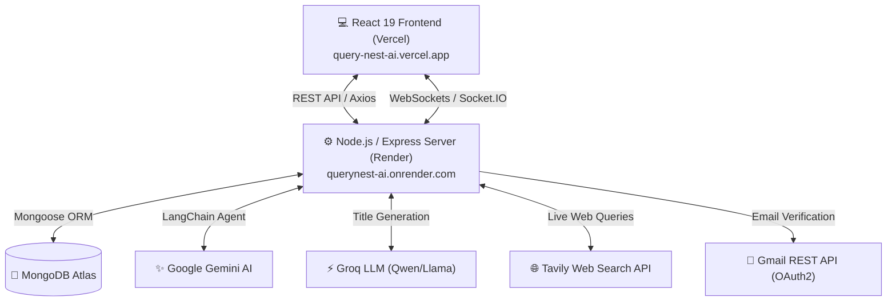

# 🪹 QueryNest AI - Next-Gen Conversational AI Assistant

[](https://query-nest-ai.vercel.app)
[](https://querynest-ai.onrender.com)
[](LICENSE)

QueryNest AI is an advanced, full-stack conversational AI platform built with **React 19**, **Node.js/Express**, **LangChain**, and **Socket.IO**. It combines multi-model LLM orchestration (Google Gemini 2.0/3.5 & Groq) with **real-time internet web search (Tavily AI)** to provide accurate, up-to-date answers in a sleek, modern user interface.

---

## 🌟 Key Highlights & Features

- 🤖 **LangChain AI Agent Integration**: Autonomous agent leveraging Google Gemini and Groq models with dynamic fallback strategies for high availability.
- 🌐 **Real-Time Web Search (Tavily AI)**: The AI automatically queries the live web for breaking news, current events, and live documentation when required.
- ⚡ **Real-Time WebSockets**: Bi-directional communication powered by **Socket.IO** for streaming chat updates and responsive interaction.
- 🏷️ **Smart Conversation Titling**: Automatically generates context-aware 2–5 word chat titles using Groq LLMs.
- 🔐 **Production Auth & Email Verification**: Secure JWT authentication with HTTP-Only cross-site cookies (`SameSite=None`, `Secure`) and automated email verification via **Gmail REST API (OAuth2 over HTTPS Port 443)**.
- 🎨 **Modern Glassmorphic UI**: Built with **React 19**, **Tailwind CSS**, Redux Toolkit, Lucide Icons, and full **Markdown & Syntax-Highlighted Code** rendering.
- 🚀 **Production Ready Deployment**: Fully configured for cross-domain production deployment on **Vercel** (Frontend) and **Render** (Backend).

---

## 🏗️ System Architecture



---

## 🛠️ Tech Stack

### **Frontend**
- **Framework**: React 19, Vite
- **State Management**: Redux Toolkit (`@reduxjs/toolkit`), React Redux
- **Routing**: React Router v7 (`react-router-dom`)
- **Styling**: Tailwind CSS, Lucide Icons
- **Real-Time**: Socket.IO Client (`socket.io-client`)
- **Markdown & Code**: `react-markdown`, `remark-gfm`

### **Backend**
- **Runtime**: Node.js (ES Modules)
- **Framework**: Express 5
- **Database**: MongoDB Atlas with Mongoose ORM
- **Authentication**: JSON Web Tokens (`jsonwebtoken`), `cookie-parser`, `bcryptjs`
- **Email Delivery**: Google Cloud OAuth2 REST API (`googleapis`), Nodemailer fallback
- **Real-Time**: Socket.IO Server (`socket.io`)

### **AI & Machine Learning**
- **Agent Framework**: LangChain (`langchain`, `@langchain/core`, `@langchain/google-genai`, `@langchain/groq`)
- **Primary LLM**: Google Gemini (`gemini-2.0-flash` / `gemini-1.5-flash`)
- **Title LLM**: Groq (`qwen/qwen3.8-27b` / `llama3`)
- **Live Web Search**: Tavily Search Core API (`@tavily/core`)

---

## 📡 API Endpoints Reference

### **Authentication (`/api/auth`)**
| Method | Endpoint | Description | Access |
|---|---|---|---|
| `POST` | `/api/auth/register` | Register new user & send verification email | Public |
| `GET` | `/api/auth/verify-email` | Verify user email token | Public |
| `POST` | `/api/auth/login` | Authenticate user & issue HTTP-Only JWT cookie | Public |
| `GET` | `/api/auth/get-me` | Get current logged-in user profile | Authenticated |
| `GET` | `/api/auth/logout` | Clear auth cookie & end session | Authenticated |

### **Chat & Messages (`/api/chats`)**
| Method | Endpoint | Description | Access |
|---|---|---|---|
| `GET` | `/api/chats` | Fetch all user chat sessions | Authenticated |
| `POST` | `/api/chats/message` | Send message & receive AI response (with web search) | Authenticated |
| `GET` | `/api/chats/:chatId/messages` | Get message history for a specific chat session | Authenticated |
| `DELETE` | `/api/chats/:chatId` | Delete a chat session and its message history | Authenticated |

---

## 🔑 Environment Variables Setup

### **Backend Environment Variables (`backend/.env`)**
```env
# Server & Database
PORT=3000
MONGO_URI=mongodb+srv://<user>:<password>@cluster.mongodb.net/QueryNest-AI
JWT_SECRET=your_super_secret_jwt_key
CLIENT_URL=https://query-nest-ai.vercel.app
BACKEND_URL=https://querynest-ai.onrender.com
NODE_ENV=production

# AI Services
GEMINI_API_KEY=your_google_gemini_api_key
GROQ_API_KEY=your_groq_api_key
TAVILY_API_KEY=your_tavily_search_api_key

# Email Verification (Gmail REST API / OAuth2)
GOOGLE_USER=your_email@gmail.com
GOOGLE_APP_PASSWORD=your_google_app_password
GOOGLE_CLIENT_ID=your_oauth2_client_id
GOOGLE_CLIENT_SECRET=your_oauth2_client_secret
GOOGLE_REFRESH_TOKEN=your_oauth2_refresh_token
```

### **Frontend Environment Variables (`frontend/.env`)**
```env
VITE_API_BASE_URL=https://querynest-ai.onrender.com
VITE_SOCKET_URL=https://querynest-ai.onrender.com
```

---

## 💻 Local Development Setup

### **Prerequisites**
- Node.js `v18.x` or higher
- MongoDB local instance or MongoDB Atlas cluster URL
- Free API Keys: [Google AI Studio](https://aistudio.google.com/), [Groq Cloud](https://console.groq.com/), [Tavily AI](https://tavily.com/)

### **Installation**

1. **Clone the Repository**:
   ```bash
   git clone https://github.com/waisshaikh/QueryNest-AI.git
   cd QueryNest-AI
   ```

2. **Setup Backend**:
   ```bash
   cd backend
   npm install
   # Create .env file using the environment template above
   npm run dev
   ```

3. **Setup Frontend**:
   ```bash
   cd ../frontend
   npm install
   # Create .env file pointing VITE_API_BASE_URL to http://localhost:3000
   npm run dev
   ```

4. **Access App**: Open your browser at `http://localhost:5173`.

---

## 🛡️ Production & Security Considerations

- **Cross-Site Cookies**: Auth cookies use `SameSite=None` and `Secure` attributes, allowing secure cross-domain authentication between Vercel (`.vercel.app`) and Render (`.onrender.com`).
- **IPv4 Fallback & HTTPS Emailing**: Cloud hosts (like Render) block outbound SMTP ports 25, 465, and 587. Email delivery utilizes the **Gmail REST API over HTTPS Port 443** to guarantee reliable delivery.
- **SPA Client Routing**: Configured with `vercel.json` rewrites to prevent 404 errors on browser page reloads.

---

## 👨‍💻 Author

**Wais Shaikh**
- GitHub: [@waisshaikh](https://github.com/waisshaikh)
- Project Repository: [QueryNest-AI](https://github.com/waisshaikh/QueryNest-AI)
- Live Application: [query-nest-ai.vercel.app](https://query-nest-ai.vercel.app)

---

## 📜 License

This project is licensed under the [MIT License](LICENSE).
